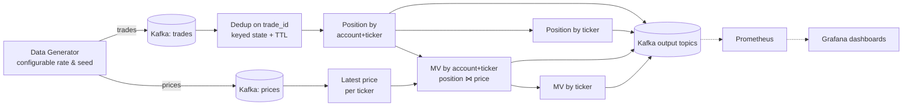

# Flink Trading Demo — Design & Delivery Plan

Status: **DRAFT — for team review**
Source: [Requirements.txt](Requirements.txt)

---

## 1. What we are building

A deterministic Apache Flink streaming application that consumes mocked trading data
from Kafka and produces real-time positions and market values, instrumented end to end,
runnable on a laptop (Docker Compose) and deployable to AWS without code changes.

### Inputs (Kafka topics)
| Topic | Schema | Notes |
|---|---|---|
| `trades` | trade_id, account, ticker, qty, event_time | Block trades; may contain duplicates |
| `prices` | symbol, price, event_time | Ticking market data |

### Outputs (Kafka topics + queryable)
1. `position-by-account-ticker` — running net qty keyed by (account, ticker)
2. `position-by-ticker` — running net qty keyed by ticker
3. `mv-by-account-ticker` — position × latest price, keyed by (account, ticker)
4. `mv-by-ticker` — aggregate market value keyed by ticker

---

## 2. Architecture

### Key design decisions (industry best practices)

| Concern | Decision | Rationale |
|---|---|---|
| Language/API | **Java 17, Flink DataStream API** | Industry standard for Flink; full control over state, timers, metrics |
| Duplicates | **Keyed state on `trade_id` with state TTL** + Kafka exactly-once checkpointing | Idempotent processing; TTL bounds state growth |
| Money math | **Long cents / scaled decimals (no floating point)** | Deterministic, exact — a very large price is just another long (Case 2: no perf impact) |
| Determinism | Event-time semantics, watermarks, **seeded generator**, keyed state only | Same input → same output, reproducible demos |
| Scaling | `keyBy(account,ticker)` / `keyBy(ticker)` partitioning; **parallelism set via config/env, not code** | Linear CPU scaling without rebuild (rescale from savepoint) |
| Config | All knobs (rates, parallelism, topics, checkpoint interval) via properties file / env overrides | Requirement: no new build to change behavior |
| Fault tolerance | RocksDB state backend, incremental checkpoints, exactly-once sinks | Production-grade defaults |
| Metrics | Flink built-ins (numRecordsIn/Out per operator) + custom Counters/Meters for **records/sec and KB/sec per operator** → Prometheus reporter → Grafana | Requirement: count output of all operators, rates, volume |
| Local runtime | Docker Compose: Kafka, Flink (JM + n×TM), Prometheus, Grafana | One-command laptop demo |
| AWS runtime | **Amazon Managed Service for Apache Flink + MSK Serverless + Amazon Managed Grafana**, provisioned via Terraform | Managed, low-ops, same jar as local |

### Why market value stays fast under load (the two required cases)
- **Case 1 (orders at 1000/sec):** positions are per-key running sums — O(1) state update per event; throughput scales with parallelism, latency grows only with backpressure, which the dashboard will show.
- **Case 2 (very high price):** price magnitude never changes the work done — fixed-width long arithmetic, and price updates only touch the `(ticker)` keyed state, isolated from the order path.

---

## 3. Delivery plan — phased, each phase ends in a review

Mirrors the team lifecycle in Requirements.txt. **We stop for review at the end of every phase.**

### Phase 1 — Design review *(this document)*
**Outcome to review:** this plan + dataflow diagram. Agree on stack, schemas, topics, metrics list.

### Phase 2 — Walking skeleton, end to end on laptop
- Repo scaffolding (Maven, CI-friendly layout), Docker Compose (Kafka, Flink, Prometheus, Grafana)
- Seeded data generator (configurable trades/sec, prices/sec, #accounts, #tickers)
- Pipeline v1: dedup → position by account/ticker → Kafka sink
**Outcome to review:** `docker compose up`, watch positions flow end to end; walk through the code.

### Phase 3 — Full calculations + observability
- Position by ticker, MV by account/ticker, MV by ticker (position ⋈ latest price)
- Custom metrics on every operator: records in/out, records/sec, KB/sec
- Grafana dashboard: per-operator throughput, latency, checkpoint health, backpressure
**Outcome to review:** live dashboard demo; explain every number on it.

### Phase 4 — Correctness validation (deterministic)
- Unit tests per operator (Flink test harness) + end-to-end test with a small fixed dataset and hand-computed expected outputs
- Duplicate-injection test proving dedup; reproducibility test (same seed → identical outputs)
- Completeness check: sum of per-account positions == position by ticker
**Outcome to review:** green test suite + a one-page "here's how we know the numbers are right".

### Phase 5 — AWS deployment
- Terraform: MSK Serverless, Managed Flink app, Managed Grafana, IAM, VPC
- Same jar + same generator, config-only differences; runbook for deploy/rescale
**Outcome to review:** live AWS demo with Grafana, deployed from scratch via IaC.

### Phase 6 — Performance & scaling validation
- Case 1: raise orders to 1000/sec via config only — show stable throughput, quantify latency
- Case 2: set price to extreme values — show no perf/latency impact on order path
- Linear-scaling test: parallelism 1 → 2 → 4 (config only), plot throughput vs CPU
**Outcome to review:** results write-up with dashboard screenshots; final team demo script.

---

## Phase 7 — Price-tick fan-out: prove the bottleneck, then conflate

**Theory (raised in review):** the MV joins emit one record per *holder* on every
price tick — O(holders) work per tick. MV work/sec = prices/sec × avg holders per
ticker. Worse, backpressure from the MV operator propagates upstream through the
**shared position operator** into the order path — so a price storm can slow
trades, violating the Case-1 guarantee. At 10×+ price rates with realistic
holder counts this must bottleneck.

### Step 1 — Prove it (config-only stress test)
1. Make fan-out realistic: `generator.accounts=50` (each tick re-values ~50
   holders at account level)
2. Baseline probe, then price storms at 10× (200/s) and 100× (2,000/s) —
   trades held constant at 1000/s
3. Measure: MV emission rate, MV-operator busy time, backpressure, and — the
   key number — **order-path latency** (trade → position output)
4. Find the knee: the price rate where busy → 1000 ms/s and order latency rises

### Step 2 — Fix: conflated re-valuation (a real window, used deliberately)
- **Position-driven MV stays immediate** — the order path never waits
- **Price-driven re-valuation conflates**: store the latest price per ticker;
  a per-key processing-time timer fires every `mv.reval.interval.ms` (config,
  e.g. 250 ms; `0` = today's per-tick behavior) and re-values holders **once**
  with the latest price — intermediate ticks are absorbed
- Bounds price-driven work at holders × (1000/interval) per ticker/sec,
  independent of tick rate
- Semantics preserved: after quiesce, final MV = position × latest price, so
  the whole validation suite must still pass unchanged
- New metric `demoTicksConflated` proves the mechanism on the dashboard

### Step 3 — Verify the fix
1. Unit tests: harness with controlled processing time — N ticks in one
   interval → exactly one re-valuation at the last price; position updates
   still emit immediately; interval=0 behaves exactly as before
2. Re-run the Step-1 storms: expect flat order-path latency, bounded MV
   output, zero sustained backpressure at 100× prices
3. `make test` and `make validate` all green (final-state semantics unchanged)
4. Results appended to docs/PERF_RESULTS.md; README state/window section updated

**Review gate:** stress-test numbers before the fix, then after — same probes,
same configs.

## 4. Open questions for review
1. Java/DataStream is proposed — any preference for PyFlink or Flink SQL instead?
2. AWS target: Managed Service for Apache Flink (proposed) vs. self-managed on EKS?
3. Output consumption: are Kafka topics sufficient, or do we also want a sink to a DB/S3 for inspection?
4. Any required Flink version (proposing latest stable 1.20.x for MSF compatibility)?

---

## Phase 9 — Confluent Cloud edition (in addition to AWS)

Open question #1 above, answered by building it: the same requirements,
re-implemented in **Flink SQL on Confluent Cloud**, verified by the same
independent validation checks. The AWS/DataStream version stays; this is a
parallel deployment target, not a replacement.

Why a rewrite and not a port: Confluent Cloud's managed Flink exposes Flink
SQL and the Table API only — no DataStream API — so the KeyedProcessFunction/
timer code cannot run there. Full analysis in prompts/phase9_prompt.txt.

- **9.2** `confluent/sql/` — the pipeline as SQL: dedup (ROW_NUMBER per
  trade_id), positions (keyed SUM upserts), 250 ms tumbling-window price
  conflation (the SQL twin of the Phase 7 timer), MV joins in exact DECIMAL,
  sinks with the same JSON field names as the Java pipeline.
- **9.3** `infra-confluent/` — separate Terraform root: environment, Basic
  cluster, topics, service account/API keys, Flink compute pool, one
  `confluent_flink_statement` per SQL file.
- **9.4** Existing Java generator reused locally (kafka.props.* SASL/PLAIN);
  `scripts/confluent_validate.py` re-runs the 5 checks; Metrics API probe.
- **9.5–9.6** Deploy (gate: Confluent API keys), validate green, load-test
  ladder with stats per rung.
- **9.7–9.8** Runbook + README comparison section; teardown with verified
  zeros; squash-merge, tag Phase-9.

**Outcome to review:** the same validation suite passing against two
implementations on two clouds, plus a DataStream-vs-SQL comparison table.

---

## Phase 10 — AWS efficiency parity (match Confluent's 232k, don't outspend it)

Phase 9's 232.7k msgs/s on Confluent was a backlog-drain (ceiling) number;
AWS's 110k was ingest-limited at 52% busy. Phase 10 measures AWS the same
way and tunes for throughput-per-dollar instead of scaling out:

- **10.1** Baseline drain at P=12, stack as-is — the true current ceiling.
- **10.2** Rung A, config only: partitions 32, sink batching + lz4,
  `ParallelismPerKPU` 2–4 on the same 12 KPUs.
- **10.3** Rung B, code: conflated *emission* on position/MV outputs (the
  Phase 7 timer pattern applied to sinks); validation must stay green.
- **10.4** Verdict: both clouds in one table — msgs/s, units, $/hr, and
  msgs/s-per-dollar — same drain methodology. Target ≥232k on ≤12 KPUs.
- **10.5** More KPUs only as a recorded last resort.
- **10.6** Teardown with verified zeros, squash-merge, tag Phase-10.

**Outcome to review:** AWS hitting the Confluent bar at equal-or-lower
cost, or an honest account of which lever fell short and why.
