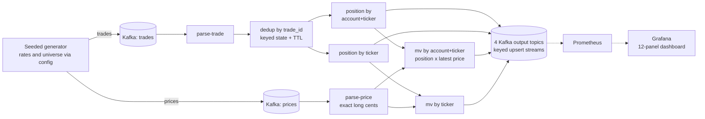
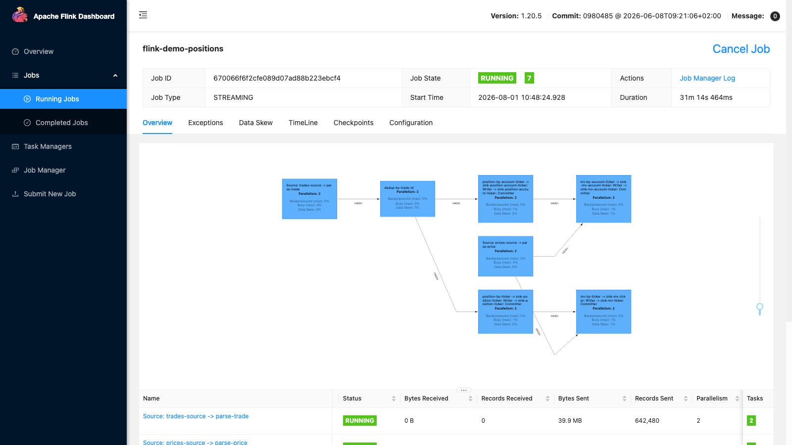
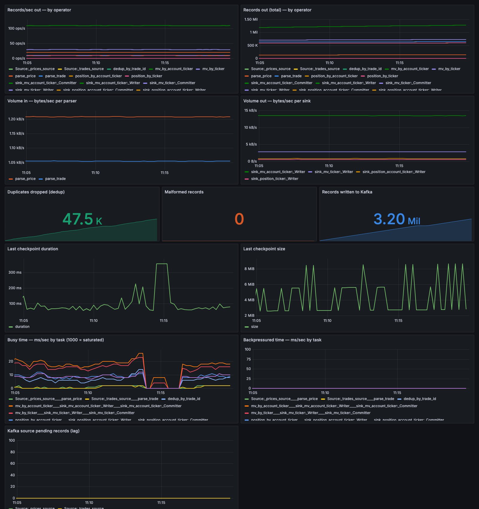
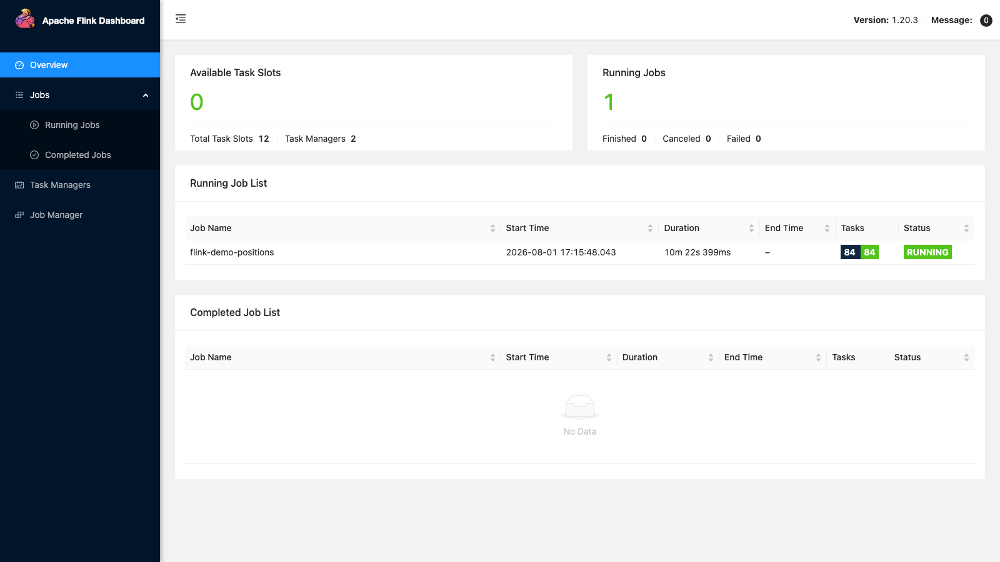

# Real-Time Positions & Market Value on Apache Flink

A deterministic streaming pipeline: mocked block trades and ticking prices go into
Kafka; live **positions** and **market values** (by account and by ticker) come out —
exact to the penny, deduplicated, fully observable, and load-tested. Runs on a laptop
with one command; deploys to AWS with the **same jar** via Terraform.

> Built in one day with [Claude Code](https://claude.com/claude-code) from a 25-line
> requirements file. Eight engineering prompts drove the whole build — all of them
> recorded in [`prompts/`](prompts/). The story: [docs/LINKEDIN_ARTICLE.md](docs/LINKEDIN_ARTICLE.md).

## Headline results

| Claim | Evidence |
|---|---|
| **1,000 orders/sec, latency unchanged** | p50 96 ms at 1000/s vs 100 ms at 10/s; ~5% CPU, zero backpressure ([results](docs/PERF_RESULTS.md)) |
| **Extreme prices can't hurt the order path** | $10¹³ price at 1000/s: identical throughput, MV exact to 19 digits |
| **Provably correct** | 18 unit tests + independent recompute of every output from raw topics: 6/6 checks pass ([how](VALIDATION.md)) |
| **Duplicates handled** | keyed state + TTL; 959 injected duplicates in 20,210 trades — all dropped, verified |
| **Price storms can't stall orders** | 10,000 ticks/s: conflated re-valuation does 240× less work, zero backpressure, flat order latency |
| **Built twice, on two clouds, judged by one test suite** | Same pipeline re-implemented in ~200 lines of Flink SQL on Confluent Cloud — same 5 checks pass, exact to the cent ([Confluent edition](docs/CONFLUENT_RUNBOOK.md)) |
| **DataStream sustains 5.5× SQL** | Identical live load, market and metric on the same hardware: median 5,183/s vs 950/s. The gap **widens** with key count — ~2× at 30 symbols, ~5.5× at 3,000 ([results](docs/PHASE19_RESULTS.md)) |
| **SQL can't be scaled by buying compute** | Doubling AWS parallelism gave +17% throughput (inside the ±25% noise band) for +83% cost; Confluent's autoscaler simply kept drawing 10 CFU whatever the pool allowed. DataStream converts extra hardware into throughput — this SQL does not |
| **Conflating before a narrow stage is worth 2.66×** | The price feed funnels through ten ticker-keyed workers; cutting volume before that narrowing beat every config knob |
| **A product requirement found the real gap** | Capping output at human reading speed is one connector option on AWS SQL and **not expressible in Confluent SQL at all** — verified under saturation on AWS at 45.3 updates/s across 50 keys |
| **Confluent names expensive queries; MSF does not** | Both platforms inserted the same state-heavy correction operator. Confluent flagged it in the console with a doc link; on MSF it was found only by reading an execution plan |
| **A single Confluent statement caps at ~10 CFU** | A pool allowed 20 CFU drew a measured max of 10, with ~3,000 keys available — so not key starvation. Mechanism unestablished; the decisive test (two concurrent statements on one pool) is unrun ([results](docs/PHASE18_RESULTS.md)) |
| **Correctness proven, not assumed** | Six checks recompute every output from the raw topics with exact decimal arithmetic: dedup, both position aggregations, cross-aggregation completeness, and both market-value paths against the final raw price |
| **A hot IPO costs two thirds of ingest** | 873k → 293k prices/s when one symbol takes 90% of the tape; adaptive write-time keying recovers it to 789k while quiet symbols keep per-symbol ordering |
| **64% of the AWS bill is Kafka, not Flink** | $1.84/hr = $0.66 compute + $0.75 MSK base + $0.43 partitions. Partitions are billed on AWS and free on Confluent |

> **Numbers:** [`docs/PHASE19_RESULTS.md`](docs/PHASE19_RESULTS.md) is current
> and supersedes all earlier performance figures. Everything there is gated on
> correctness — six independent checks recomputed from the raw topics — and
> measured on a realistic market (3,000 symbols, Pareto-distributed, one hot
> IPO). Earlier figures were taken on a workload of at most 30 symbols due to a
> silent clamp, and the scaling conclusions among them were artifacts of that.

## Architecture



Hard to read inline? **[Open full-screen in your browser](https://mermaid.live/view#pako:eNpdklFPwjAQx7_KZU8anEbjEzEkLCgPgiw4fZnEHO0NGrZ2aTuEAN_drhsE6FN7_d_vf7m7XcAUp6ALQZarP7ZEbWE0_ZHgzvD1I_0k4sRhQZI0WqVf5vqh525kACWHSoo1aUOwFghMyUwsZhCGvb3VyMnsIUlv3jFbYReayO3sxPa6UgtW6-KTrokcdUmtgjhJS3Q2oYd4BxgMUldZVcJ827B_BffVrWjrKjbWFQkdSJJRi4obVNyivI9PoA0yC7mSC2AkrWn1g0GT0E9LZYQVSjorn4CMqUrajhVsRfpKHp3L4UIS971k_N1Pi3X9ewny7FPyBvK6zbZpyJEQtYSoJVzy4yP_6h1d-E--3FSewfcbVGXLyoJVpWDmrH9VacjtgrGasDiNo_V3hObtrK4DVwp3gfC-bsx0Mk5jrQqyS6rMrIkOp_23dKgxQ4ne_fEpLFFSDhzNcq5Q81lwB0FBukDB3aLuApdf-JWVVLnJ58Hh8A9u7OAb)**

The real thing — the Flink job graph, running (7 operator chains, parallelism 2):
*(click screenshots to view full size)*

[](docs/images/flink-job-graph.png)

## Quick start

Prereqs: JDK 17+, Maven, Docker Desktop.

```bash
make up          # build jar, start Kafka + Flink + generator + Prometheus + Grafana
make positions   # tail the position-by-account-ticker output topic
make status      # Flink job status via REST
make down        # stop everything (make clean also wipes state)
```

| UI | URL |
|---|---|
| Flink dashboard | http://localhost:8081 |
| Grafana (dashboard auto-provisioned) | http://localhost:3000/d/flink-demo |
| Prometheus | http://localhost:9090 |

## Data contracts

All messages are JSON; output topics are keyed **upsert streams** (latest record per
key is the current state).

| Topic | Direction | Key | Schema |
|---|---|---|---|
| `trades` | in | trade_id | `{trade_id, account, ticker, qty, event_time}` |
| `prices` | in | symbol | `{symbol, price ("184.52"), event_time}` |
| `position-by-account-ticker` | out | account\|ticker | `{account, ticker, net_qty, as_of}` |
| `position-by-ticker` | out | ticker | `{ticker, net_qty, as_of}` |
| `mv-by-account-ticker` | out | account\|ticker | `{account, ticker, net_qty, price, mv, as_of}` |
| `mv-by-ticker` | out | ticker | `{ticker, net_qty, price, mv, as_of}` |

## Design decisions worth knowing

- **Dedup**: keyed state on `trade_id` with a TTL — first occurrence wins, replays are
  absorbed idempotently. Restart-safe: generator runs namespace their trade ids.
- **Money is never a float**: prices parse to long cents; market value is BigDecimal
  from long cents. Exact at any magnitude — that's why the extreme-price case is safe
  *by construction*, not by tuning.
- **AT_LEAST_ONCE + keyed upserts** instead of transactional sinks: outputs are
  full-state snapshots per key, so replays are harmless and consumers need no
  read-committed complexity. (Checkpointing itself is exactly-once.)
- **Determinism**: seeded generator, commutative position sums, exact math — same
  inputs produce identical final state, proven by test.
- **Everything is configuration** ([config/application.properties](config/application.properties)):
  generator rates, universe, seed, duplicate ratio, price override, parallelism,
  checkpoint interval, dedup TTL. No behavior change requires a rebuild.

## State & windows

Every output is a continuous per-key aggregation — no time windows on the order
path, which stays deterministic and O(1) per record. The **one deliberate window**
is a conflation interval on price-driven re-valuation (`mv.reval.interval.ms`,
default 250 ms): a price tick would otherwise re-value every holder — O(holders)
per tick — and a price storm's backpressure propagates through the shared
position operator into the order path. Proven and fixed in Phase 7: at 10,000
ticks/sec the per-tick design saturated (517k MV/s, sustained backpressure);
conflated, the same storm runs at 404 ms/s busy, zero backpressure, flat order
latency, 99.6% of ticks absorbed — final state still position × latest price
(validation suite unchanged). All state lives in **RocksDB with incremental
checkpoints** (interval config-driven, default 10s).

| Operator | Keyed by | State | Bounded by |
|---|---|---|---|
| Kafka sources | — | partition offsets | # partitions |
| `parse-trade` / `parse-price` | — | stateless | — |
| `dedup-by-trade-id` | trade_id | `ValueState<Boolean>` **with TTL** (`dedup.state.ttl.ms`, default 1h) | distinct trade ids within the TTL horizon — the only state that grows with throughput |
| `position-by-account-ticker` | account\|ticker | `ValueState<Long>` net qty | one long per account×ticker |
| `position-by-ticker` | ticker | `ValueState<Long>` net qty | one long per ticker |
| `mv-by-account-ticker` | ticker | `MapState<account, qty>` + `ValueState` last price/time + reval-pending flag + conflation timer | accounts-per-ticker + O(1) per ticker |
| `mv-by-ticker` | ticker | `ValueState` qty, last price/time + reval-pending flag + conflation timer | O(1) per ticker |
| Kafka sinks | — | writer buffers only (AT_LEAST_ONCE, no transaction state) | — |

Keying both join inputs by `ticker` co-locates the latest price with every position
for that ticker — a price tick re-values all holders with no shuffle. The closest
things to a "window" in the system: the dedup TTL (bounded replay-detection
horizon), the checkpoint interval (fault tolerance, not semantics), and the 60s
meter window on rate metrics (reporting only). Time-bucketed outputs (per-minute
snapshots, OHLC) are the natural extension point where real windows and watermarks
would enter.

## Observability

Every operator reports records in/out, rates, and real serialized **bytes/sec**;
plus duplicates dropped, malformed counts, checkpoint duration/size, busy vs
backpressured time per task, and Kafka consumer lag. Grafana auto-provisions this
dashboard (colors are CVD-validated and pinned per operator):

[](docs/images/grafana-dashboard.png)

Tail any topic: `make tail TOPIC=mv-by-ticker`

## Correctness

```bash
make test        # 18 JUnit tests: real operators under Flink test harnesses,
                 # incl. a hand-computed golden dataset and duplicate injection
make validate    # pauses the generator, dumps all six topics, independently
                 # recomputes every output in Python, compares exactly:
                 # dedup, reproducibility, completeness (Σ accounts == ticker),
                 # market values to the penny
```

The one-page "how we know the numbers are right": [VALIDATION.md](VALIDATION.md)

## Performance & scaling

Measured with [`scripts/perf_probe.py`](scripts/perf_probe.py) (Prometheus sampling +
per-record write latency) and [`scripts/scaling_test.py`](scripts/scaling_test.py)
(capacity via backlog drain at saturation). Full tables and the demo script for
explaining every number: [docs/PERF_RESULTS.md](docs/PERF_RESULTS.md)

| | baseline 10/s | 1,000/s | 1,000/s + $10¹³ price |
|---|---|---|---|
| busiest task | 0.9% | 5.2% | 4.9% |
| backpressure / lag | 0 / 0 | 0 / 0 | 0 / 0 |
| latency p50 | 100 ms | **96 ms** | 118 ms |

The ladder, as measured on AWS (per-subtask throughput — overload rungs,
drain, then P=12 sustaining the full 110k msgs/s; click to expand):

[](docs/images/aws-ladder-throughput.png)

[](docs/images/aws-busy-backpressure.png)

The live Flink cluster on Amazon Managed Service for Apache Flink during the
finale — 84 tasks (7 operators × parallelism 12), all slots busy:

[](docs/images/aws-flink-ui.png)

Capacity at saturation: locally P=1 ≈ 7,000 rec/s → P=2 ≈ 14,300 (2.0×,
linear), P=4 host-limited. **On AWS (real KPUs): P=2 → 4 → 8 processed
~16.5k → ~52k → ~97k msgs/s** under sustained overload — each rescale one
tfvar, zero job restarts (MSF snapshots). Capacity model ≈ 12k msgs/s per
KPU; the 110k/s mega-load is a ~P=10 dial, and the next efficiency lever
(Avro instead of JSON) is identified and priced in
([playbook](docs/PERF_RESULTS.md)).

## AWS

[`infra/`](infra/) is a complete, validated Terraform stack: **MSK Serverless**
(IAM auth) + **Amazon Managed Service for Apache Flink** (same jar, from versioned
S3) + Fargate generator + CloudWatch dashboard. Rescale with
`terraform apply -var flink_parallelism=N`. Deploy/update/teardown:
[docs/AWS_RUNBOOK.md](docs/AWS_RUNBOOK.md) (≈ $1/hr while running).

## Confluent Cloud (same pipeline, rewritten in Flink SQL)

[`confluent/sql/`](confluent/sql/) + [`infra-confluent/`](infra-confluent/) are a
second, fully independent deployment target: the identical requirements
re-implemented as **six Flink SQL statements on Confluent Cloud's serverless
Flink** (which has no DataStream API — see the analysis in
[prompts/phase9_prompt.txt](prompts/phase9_prompt.txt)). The topics keep the
same names and plain-JSON contracts, so the **same generator jar and the same
five validation checks run unchanged against both stacks — and pass**. The
Phase 7 conflation timer becomes a 250 ms tumbling window: in the measured
storm test, 10,000 prices/s in → ~10 conflated updates/s out (~950×), with
the order path untouched. Volume was measured by backlog drain: 132.6k
msgs/s inside a 10-CFU cap, **232.7k msgs/s** inside a 20-CFU cap (the
autoscaler used 16) — 1.2× and 2.1× the AWS 110k finale, both runs ending
because the 26M-record backlog ran out, not capacity. Estimated monthly
cost: parity with AWS under ~10k msgs/s; sized to the same 110k msgs/s
job, roughly 40% less. Results in
[docs/PERF_RESULTS.md](docs/PERF_RESULTS.md#phase-9--confluent-cloud-edition-same-pipeline-rewritten-in-flink-sql-2026-08-02),
deploy/gotchas in [docs/CONFLUENT_RUNBOOK.md](docs/CONFLUENT_RUNBOOK.md).

DataStream vs SQL, one line each way: DataStream buys the surgical stuff —
per-key timers, custom metrics, explicit parallelism; SQL buys ~200 lines
instead of ~2,000, no jar, no VPC, and a rewrite that a validation suite can
prove equivalent in an afternoon.

## Repository map

```
src/main/java/…/pipeline/    Flink job: parsers, dedup, aggregators, MV joins, sinks
src/main/java/…/generator/   seeded Kafka data generator (same jar, plain-JRE main)
src/test/java/               operator-harness tests + golden end-to-end dataset
config/                      every runtime knob, laptop and generator alike
docker-compose.yml           Kafka (KRaft) + Flink + generator + Prometheus + Grafana
monitoring/                  Prometheus config, provisioned Grafana dashboard
infra/                       Terraform for AWS (MSK, Managed Flink, Fargate, CloudWatch)
confluent/sql/               the same pipeline as Flink SQL (Confluent Cloud edition)
infra-confluent/             Terraform for Confluent Cloud (cluster, pool, statements)
scripts/                     validate_live.py, perf_probe.py, scaling_test.py, confluent_*
prompts/                     the six engineering prompts that built this, per phase
docs/                        PLAN follow-ups: perf results, AWS runbook, article, exec deck
PLAN.md / VALIDATION.md      the design doc and the correctness one-pager
```

## Provenance

The project followed a phased plan ([PLAN.md](PLAN.md)), each phase ending in a
review: design → walking skeleton → full calculations + dashboard → correctness
suite → AWS IaC → load tests → price-storm conflation (a Phase 7 born from a
review finding — the fan-out bottleneck was predicted by a human, then proven
and fixed the same day) → AWS deployment + the measured scaling ladder
(Phase 8) → the Confluent Cloud edition, proven equivalent by the same
validation suite (Phase 9) → efficiency parity: emission-conflation tuning
(+89%), the 10-KPU cost floor matching Confluent's peak at a third of the
compute cost, and linear scale-up re-proven with all tuning applied
(Phase 10). Git history mirrors it: one squash commit per
phase, tagged `Phase-2`…`Phase-10`, with the detailed history preserved on the
phase branches. Executive summary deck:
[docs/flink-demo-exec-briefing.pptx](docs/flink-demo-exec-briefing.pptx).
The story, in ~530 words:
[the LinkedIn article](https://www.linkedin.com/pulse/i-built-production-grade-flink-trading-pipeline-one-day-zucker--xsqjc/).

### What it took to build (AI-assisted, measured like everything else)

| | Session 1 (Sat) | Session 2 (Sun) | Project total |
|---|---|---|---|
| Prompts | 83 (8 engineering) | 37 (1 engineering — Phase 9) | 120 (9) |
| Assistant turns | 1,078 | 587 | ~1,665 |
| AI tokens | 394M (≈$515 metered) | 118M (≈$184 metered) | ~512M (≈$699 — flat-rate in practice) |
| Active hours | 5.7 (2.6 human review/steering) | 3.2 (1.1 human) | ~8.9 (~3.7 human) |
| Cloud spend | ~$5 AWS | ~$4 Confluent | ~$9, torn down to verified zero |

Stats parsed from the Claude Code session transcripts, the same way every
other number here was measured.
