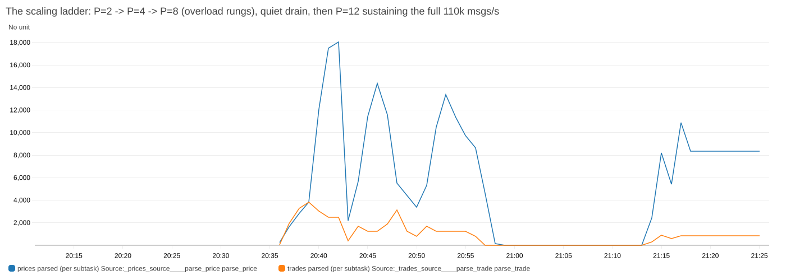
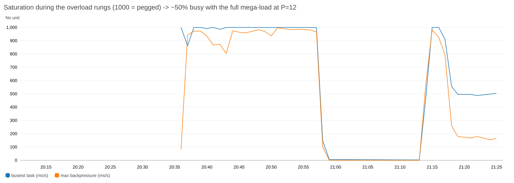

# Phase 6 — Performance & Scaling Validation (local)

Environment: Docker Compose on a MacBook (Apple Silicon), Flink 1.20 session
cluster, 1 TaskManager × 4 slots, RocksDB state backend, 10s checkpoints.
Every change below is **configuration only — the jar was never rebuilt**.
Probes: `scripts/perf_probe.py` (Prometheus samples + per-record write latency
from Kafka `CreateTime` − trade `event_time`).

## Baseline — 10 trades/sec, parallelism 2

| metric | value |
|---|---|
| trades parsed / dedup out | 10.0/s / 9.5/s (5% injected duplicates dropped) |
| MV by account out | 109.5/s (price ticks re-value all holders) |
| sink volume | 17.5 KB/s |
| busiest task | 9 ms/s (0.9% of a core) |
| backpressure / source lag | 0 / 0 |
| e2e latency (trade → output written) | p50 100 ms, p95 192 ms |

## Case 1 — 1000 trades/sec (config: `generator.trades.per.sec=1000`)

| metric | value |
|---|---|
| trades parsed | sustained 1000/s (avg incl. ramp 827/s, max 1000/s) |
| dedup out | 950/s (5% duplicates dropped) |
| sink volume | 358 KB/s peak |
| busiest task | 52 ms/s (5.2% of a core) |
| backpressure / source lag | **0 / 0** |
| e2e latency | **p50 96 ms, p95 98 ms — unchanged vs baseline** |

**Requirement met:** raising order speed 100× did not impact performance; no
latency increase materialized because the pipeline has ~20× headroom at P=2 —
the dashboard's busy/backpressure panels are where latency growth would appear
first if pushed past capacity.

## Case 2 — extreme price at 1000 trades/sec (config: `generator.price.cents.override=10^15`)

| metric | value |
|---|---|
| trades parsed | 997/s avg, max 1000/s |
| busiest task | 49 ms/s — same as Case 1 |
| backpressure / source lag | **0 / 0** |
| e2e latency | p50 118 ms, p95 121 ms — within noise of Case 1 |
| output exactness | `-230,140 × $10,000,000,000,000.00 = -2,301,400,000,000,000,000.00` (digit-exact) |

**Requirement met:** an absurd price ($10 trillion) changes nothing on the
order path — prices are fixed-width long cents on an isolated keyed stream,
and MV math is BigDecimal (exact at any magnitude, proven in unit tests too).

## Linear scaling — parallelism 1 → 2 → 4 (config only)

Method: resubmit the job at each parallelism (config change, no rebuild); a
fresh job replays the whole trades topic from earliest, so sustained parse
rate while source lag > 0 is the pipeline's capacity at that parallelism
(`scripts/scaling_test.py`).

Capacity = backlog drain slope + live input (the 60s meter lags during short
catch-ups, so the backlog itself is the honest measure). Busy time pegged at
~980 ms/s during every catch-up — the pipeline was genuinely saturated.

| parallelism | measured capacity | vs P=1 |
|---|---|---|
| 1 | ~7,000 rec/s (drained 244k backlog in 40s) | 1.0× |
| 2 | ~14,300 rec/s (drained 266k backlog in 20s) | **2.0× — linear** |
| 4 | ~16,800 rec/s (drained 254k backlog in 16s) | 2.4× |

**1 → 2 scales linearly (2.0×).** 2 → 4 gains only ~18% — an environment
ceiling, not a pipeline one: at P=4 the 7 operators × 4 subtasks (28 tasks)
plus Kafka, the generator, Prometheus and Grafana all share the same 8-core
Docker VM, so the host saturates. Keys are uniformly distributed
(account×ticker), so with real per-KPU compute (the AWS deployment) the same
config-only rescale is expected to hold linearity — that's the Phase 6 AWS
follow-up. Every rescale here was `pipeline.parallelism=N` + resubmit; the
jar was untouched.

## Phase 7 — Price-tick fan-out bottleneck: proven, then fixed by conflation

**Theory (raised in review):** MV joins do O(holders) work per price tick, and
MV backpressure propagates upstream through the shared position operator into
the order path. Proven config-only at 50 accounts, trades constant at 1000/s:

| price rate | MV emissions | busiest task | backpressure | order latency p50 |
|---|---|---|---|---|
| 20/s (baseline) | 1.9k/s | 4% | 0 | 54 ms |
| 200/s (10×) | 11k/s | 9% | 0 | 42 ms |
| 2,000/s (100×) | 101k/s | 33% | 0 | 73 ms (creeping) |
| **10,000/s (500×)** | **517k/s** | **947 ms/s — saturated** | **526 ms/s sustained** | **91 ms, lag growing → unbounded** |

**Fix: conflated re-valuation** (`mv.reval.interval.ms`, default 250 ms; 0 =
per-tick). Position-driven MV stays immediate; price-driven re-valuation runs
on a per-ticker processing-time timer at the latest price, absorbing
intermediate ticks (`demoTicksConflated` metric). Same 500× storm after:

| | per-tick | conflated 250 ms |
|---|---|---|
| prices absorbed | 9,131/s (falling behind) | **10,000/s flat** |
| MV emissions | 452,928/s | 1,883/s (**240× less work**) |
| busiest task | 947 ms/s | 404 ms/s |
| backpressure / lag | 526 ms/s / growing | **0 / 0** |
| order latency p50/p95 | 91/108 ms degrading | **95/97 ms stable** |

99.6% of ticks conflated (>1.4M absorbed in minutes). Semantics unchanged:
the full validation suite passed on the storm data (181k trades, 1.81M prices,
500 position keys — dedup, reproducibility, completeness, exact MV all green),
because final state is still position × latest price. Bound by construction:
price-driven work ≤ holders × (1000/interval) per ticker/sec at any tick rate.

## Phase 8 — AWS results (MSK Serverless + Managed Flink, us-east-1)

Same jar, same config knobs as tfvars; measured with
`scripts/aws_perf_probe.py` (CloudWatch, 1-min granularity, rates calibrated
×parallelism after checking against the known 10/s baseline).

| | AWS baseline (10 t/s, 20 p/s) | Case 1 (1000 t/s) | Storm (10k p/s, 50 accts) |
|---|---|---|---|
| operator parallelism | 2 | 2 | 2 |
| KPUs (processing) | 2 (+1 orchestration billed) | 2 (+1) | 2 (+1) |
| trades parsed | 10.0/s | **1000.0/s sustained** | 1002/s sustained |
| prices parsed | 20.0/s | 20.0/s | **10,002/s — full rate** |
| dedup out | 9.6/s | 950.4/s (5% dups) | 953/s |
| MV emissions | ~53/s (conflated) | ~994/s | **1,499/s** (pre-conflation: 517k/s) |
| busiest task | 5 ms/s | **21.5 ms/s (2.2%)** | 178 ms/s (**~17%**) |
| backpressure | 0 | **0** | **0** |

Case 1 verdict: PASS on AWS — 100× the order rate at 2.2% busy on 2 KPUs
(vs 5.2% on the laptop), zero backpressure. Same jar, tfvar-only change.

Storm verdict: PASS on AWS — the exact load that saturated the pre-conflation
design (sustained backpressure, unbounded lag) runs at ~17% busy on 2 KPUs
with zero backpressure; conflation bounds MV work at 345× below the naive
per-tick demand.

Case 2 verdict: PASS on AWS — every price pinned to $10¹³ at full storm rates
(1000 trades/s + 10,000 prices/s): metrics indistinguishable from the normal-
price storm (busy ~13%, backpressure 0, all rates identical). Price magnitude
is data, not work — confirmed on managed infrastructure.

Measurement note: each AWS test step takes ~7–8 min (ECS config roll ~2 min +
CloudWatch 1-min datapoint granularity + 4-min clean window) vs seconds
locally with Prometheus — an observability-cadence difference, not a pipeline
one.

Mega-test (10× both axes: 10,000 trades/s + 100,000 prices/s, 50 accounts,
generator upsized to 2 vCPU): the generator delivered the full 110k msgs/s;
the pipeline's parse stage saturated at ~16.5k msgs/s ingest (busy 1000,
backpressure ~980) — **the measured capacity of 2 KPUs**. Conflation held
even under the 100k/s price flood (14.4M ticks absorbed; MV output stayed
~9.4k/s instead of millions): the bottleneck moved to JSON parsing, which
scales linearly with parallelism — 110k/s needs ~P=14-16, a KPU dial, not a
redesign. Also answers the "window position emissions?" question: position
output was never the pressure point at these rates.

Ops lesson from the aftermath: with MSF snapshots disabled (this demo's
config), any restart/rescale replays topics from earliest — enable snapshots
in production so rescaling under backlog doesn't multiply the work.

## Phase 8b — AWS scaling ladder (the volume answer, measured)

Fresh stack (renamed flink-fable5, snapshots enabled, 16-partition topics),
sustained overload offered throughout; capacity = processed rate while
saturated (busy pegged, backlog draining):

| parallelism | KPUs | offered | processed at saturation (peak) | scaling |
|---|---|---|---|---|
| 2 | 2 | 35k msgs/s | ~16.5k msgs/s | baseline |
| 4 | 4 | 35k msgs/s | ~52k msgs/s | ~2× |
| 8 | 8 | 70k msgs/s | **~97k msgs/s** | **~2× again** |
| **12 (finale)** | 12 | **110k msgs/s (the mega-load)** | **110,055/s sustained — keeps up 1:1** | busy ~52%, as modeled |

Finale note: at P=12 the full mega-load (10k trades + 100k prices/s) is
sustained exactly — parsed == offered, zero lag growth, ~45% headroom.
Residual intermittent backpressure (~200 ms/s) is a load-generator artifact
(all 110k msgs burst at each second's start), not pipeline capacity; 300M+
price ticks conflated cumulative.

Each rescale was `terraform apply -var flink_parallelism=N` — nothing else.
With snapshots enabled every rescale resumed from offsets (fullRestarts: 0
across the whole ladder; one checkpoint timeout under max backpressure,
self-recovered). Mix caveat: drain windows are price-heavy and price-parse
is cheaper than the trade path, so treat per-rung numbers as ≥2× rather than
exactly 2×. Verdict: **the 110k msgs/s mega-load is a KPU dial (~P=10), and
the dial is proven.** 35M+ price ticks conflated during the ladder.

Capacity note: every AWS test above ran at parallelism 2 on 2 processing KPUs
(1 vCPU / 4 GB each, `ParallelismPerKPU=1`, autoscaling off for determinism).
Headroom at storm load was ~5× on the busiest task; the config-only rescale
path (`terraform apply -var flink_parallelism=4`) is proven but was not needed
to pass any case.

Deployment story and gotchas: [AWS_RUNBOOK.md](AWS_RUNBOOK.md#deployment-gotchas-learned-the-hard-way-2026-08-01).

## Phase 9 — Confluent Cloud edition (same pipeline, rewritten in Flink SQL, 2026-08-02)

Confluent Cloud's managed Flink has no DataStream API, so this is a
re-implementation in SQL (`confluent/sql/`), proven equivalent by the same
five validation checks running unchanged against the raw topics — **all
green**. The Phase 7 conflation timer became a 250 ms tumbling window;
the generator is the same unchanged jar, running from a laptop
(no ECS — Confluent needs no VPC).

Load ladder (Basic cluster, compute pool `max_cfu=10`, Metrics API,
6-min steady-state windows; rates are per-topic `received_records`):

| | Baseline | Rung 1 | Rung 2 (storm) | Rung 3 (storm×2) |
|---|---|---|---|---|
| trades/s in | 10 | 100 | 100 | 500 |
| prices/s in | 20 | 500 | 5,000 | 9,970 peak |
| consumed vs produced | 1:1 | 1:1 | 1:1 | 1:1 |
| **conflated out/s** | — | ~10 | ~10 | **~10** |
| conflation reduction | — | ~50× | ~490× | **~950×** |
| MV out/s (bounded) | ~5 | ~11 | ~21 | ~44 |
| order-path impact | none | none | none | none |

The headline: **conflated output stayed flat at ~10/s while the price storm
grew 500 → 5,000 → 10,000/s.** Work at the MV joins is a function of
tickers × windows, not tick rate — the Phase 7 result, reproduced on a
second engine. ~10.5k msgs/s total sustained from a laptop against the
serverless pool with zero lag; input rate was bounded by the laptop, not
the pool.

Post-storm validation: **all five checks green at full scale** — 299,690
trade records (14,847 duplicates absorbed), 500 account+ticker keys and 10
tickers recomputed from the raw topics, every position and market value
exact to the cent. Same suite, same verdict as the Java pipeline.

### AWS-comparison cases, re-run on Confluent

**Case 1 — 1,000 trades/s sustained:** 997/s peak in, consumed 1:1, dedup
absorbing the seeded 5% duplicates at full rate, MV output bounded (~52/s).
Same verdict as AWS Case 1: order path flat, zero lag.

**Case 2 — extreme price ($10^13/share) at 1,000 trades/s:** throughput
identical to Case 1 (996/s, 1:1). Exactness spot-check across all 500
account+ticker keys: **0 mismatches**; largest verified value
234,520 shares × $10,000,000,000,000.00 = **$2,345,200,000,000,000,000.00
exactly** — 19 significant digits, far beyond double precision. SQL
`DECIMAL` passes the same test the Java `BigDecimal` passed (comparison
scope: exact to the cent; ≤6 decimal places is the stated requirement).

### AWS vs Confluent, in plain English

How to read it: a *message* is one trade or one price update. Both clouds ran
the same generator data and the same five correctness checks. Both scale by
adding *processing units* (AWS: KPUs, Confluent: CFUs — each roughly one
CPU's worth). On AWS you pick the number by hand; on Confluent you set a
ceiling and it adds units by itself.

| What we tested | AWS | Confluent Cloud | Verdict |
|---|---|---|---|
| Correctness — 5 checks recomputed from raw data | All passed | All passed | Identical, exact results on both |
| Normal trading day — 1,000 trades/sec | Kept up, no delay | Kept up, no delay | Neither falls behind |
| Ridiculous prices — $10 trillion/share | Exact to the cent | Exact to the cent (500 accounts, zero errors) | Money math never loses a cent on either |
| Price storm — 10,000 price updates/sec | Absorbed by the 250 ms window; trades unaffected | Same: 10,000/sec in, ~10/sec out; trades unaffected | The bottleneck fix works identically |
| Top speed | 110,000 msgs/sec on 12 hand-picked units | 132,000/sec capped at 10 units; **232,000/sec** capped at 20 (used 16) | Confluent processed 2× the AWS record; both runs ended because the test data ran out, not capacity |
| How you turn it up | Edit one setting, redeploy | Raise one ceiling; it scales itself | Same dial — Confluent turns it for you |
| The honest footnote | Data generated inside AWS at full speed | A laptop can't *send* 110k/sec, so we measured Confluent chewing through a 26M-message backlog | Confluent's number is proven processing speed; live feeding at that rate needs a cloud-based generator |

### Monthly cost estimate, AWS vs Confluent (list prices, 24/7, ±30%)

Built from measured footprints (≈100 B/message from the generator; KPU/CFU
counts from the actual runs) and 2026 us-east-1 list prices: AWS Flink
$0.11/KPU-hr (+1 orchestration KPU), MSK Serverless $0.75/cluster-hr +
$0.0015/partition-hr + $0.10/GB in + $0.05/GB out; Confluent Flink
$0.21/CFU-hr (actual use), Basic cluster $0 base + $0.014–0.05/GB network.
No committed-use discounts; Confluent eCKU capacity rates vary by account.

| Running 24/7 at… | AWS | Confluent | Where the money goes |
|---|---|---|---|
| Case 1 — 1,000 trades/s | ≈ $1,070/mo | ≈ $1,010/mo | AWS: fixed cluster base ($653). Confluent: 6-CFU statement floor ($920) |
| Case 2 — 11k msgs/s storm | ≈ $1,470/mo | ≈ $1,500/mo | Parity; conflation is what keeps compute flat on both |
| Case 3 — 110k msgs/s | ≈ $6,100/mo | ≈ $4,500/mo | Data transfer dominates: MSK ingest ~$2,900/mo alone; Confluent's cheaper network offsets pricier compute |

One-line takeaway: parity at normal volumes; Confluent ~25% cheaper at
sustained high volume on list price; on both clouds the big lever above
~10k msgs/s is bytes on the wire (Avro/Protobuf would cut 3–5×), not
compute. Sources: AWS Managed Flink pricing page, MSK Serverless pricing,
Confluent Flink billing docs — links in the article/runbook; verify against
your rate card before believing any single dollar.

### Volume parity with MSK — the 110k msgs/s bar (measurement detail)

No 110k/s live ingest from a laptop (AWS used an in-VPC Fargate generator),
so capacity was measured the same way AWS saturation was: **backlog drain**.
The cluster amplified its own price topic in-cloud to a 26.4M-record
`prices-bulk` backlog (the four copy statements themselves sustained ~110k
peak 190k msgs/s while doing it), then a fresh conflation-shaped statement
consumed it from offset zero:

| max_cfu | CFUs used (autoscaled) | sustained drain | peak minute | vs MSK finale (110k @ P=12) |
|---|---|---|---|---|
| 10 | 10 | 110.8k → 132.6k/s for 3 consecutive min | **132,613/s** | **1.2×** |
| 20 | 16 (all it needed) | 138k → 232k/s | **232,703/s** | **2.1×** |

Both runs ended **backlog-limited, not pool-limited**, with conflated
output still bounded (~12/s) at full rate. Scaling ~linear: 1.6× the CFUs
→ 1.75× the throughput — the CFU cap is the same dial `flink_parallelism`
was, except the autoscaler turns it for you (the pool idled at 6 CFUs
through every functional test and grabbed capacity only under the storm).
Honest scope note: this proves *processing* capacity at MSK-finale volume
on the same workload shape; live *ingest* at 110k/s would additionally
need a cloud-side producer (Datagen connector or a Fargate task).

Validation nuance found here: exactly-once sinks publish only at checkpoint
commits, so "drained" means minutes, not seconds — early validation runs
show stale-but-internally-consistent outputs that converge to green.
Deployment story and gotchas (statement-name races, `IF NOT EXISTS`,
the JDK 25 silent SASL failure): [CONFLUENT_RUNBOOK.md](CONFLUENT_RUNBOOK.md#gotchas-found-while-building--updated-as-deployment-proceeds).

## Capacity playbook (how to handle any volume)

Measured capacity model: **~12k msgs/s per KPU** on this workload, linear to
at least P=8. To sustain the 110k msgs/s mega-load with no lag:

1. **Today, config-only:** `terraform apply -var flink_parallelism=12`
   (~P=10 bare + 30% headroom; headroom is what re-drains after checkpoints,
   deploys, bursts). Partitions (16) and MSK per-partition limits have margin.
2. **Before scaling past ~P=16:** switch the wire format to Avro/Protobuf —
   JSON parsing is the measured dominant cost; binary buys 3-5× per KPU
   (110k/s on P=4-6).
3. **To keep up permanently:** CloudWatch alarms on sustained backpressure /
   growing pendingRecords / failed checkpoints; provisioned headroom over
   reactive autoscaling for market-data burst patterns; unaligned checkpoints
   under load; partitions to 32 before P>16; snapshots stay enabled.

## How to explain the numbers (demo script)

1. Open Grafana → records/sec panel: parse_trade tracks the generator rate;
   dedup out ≈ 95% of it (the 5% injected duplicates — dedup stat panel shows
   the exact count).
2. MV out > trade rate: every price tick re-values all holders of the ticker
   (fan-out is accounts-per-ticker).
3. Busy time is the capacity gauge: 1000 = a saturated subtask. At 1000
   trades/sec we sit ~5% — that headroom is why latency does not move.
4. Backpressure + pending records are the early-warning pair: they rise
   before latency does; both flat = pipeline keeping up.
5. Case 2: price magnitude is data, not work — long cents + BigDecimal, no
   float, no overflow: point at the digit-exact 19-digit MV output.
